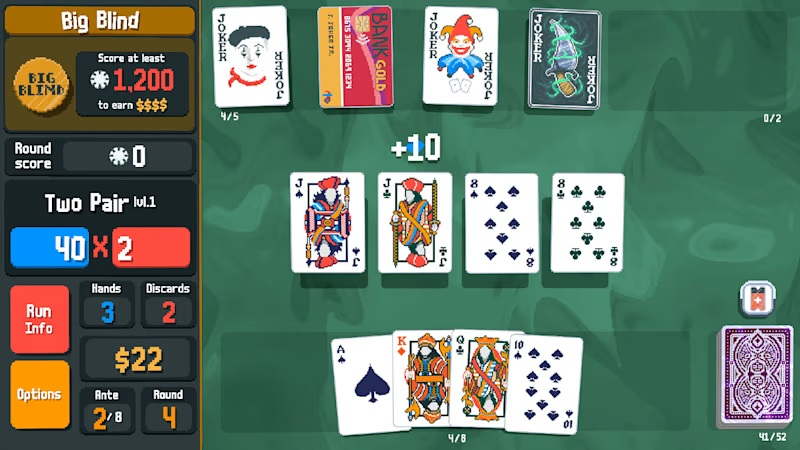
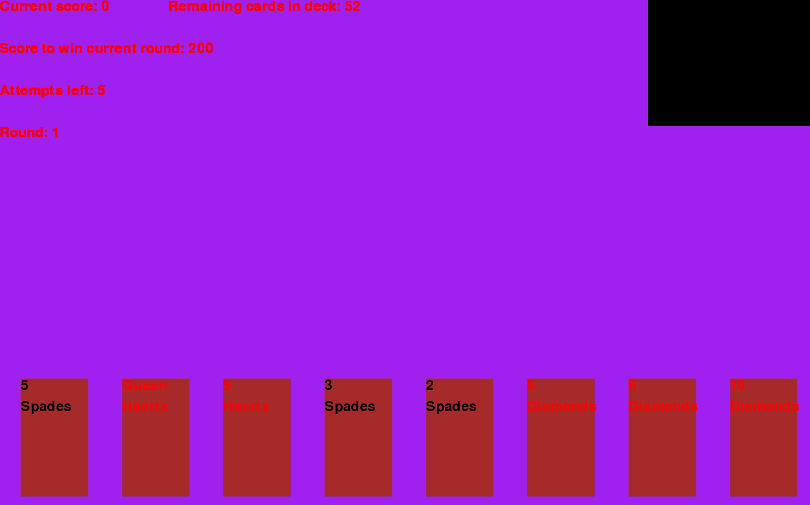

:warning: Everything between << >> needs to be replaced (remove << >> after replacing)

# Jalatro
## CS110 Final Project Spring 2024

## Team Members

Josh Levine

***

## Project Description

Making a copy of the game Balatro, a poker deckbuilder roguelike. Allows the user to take a deck starting with 52 cards and play poker hands to acquire chips, based on pre-determined combinations of chips and multiplier, which can be increased by acquiring "joker" cards from the shop in between rounds. Three rounds per stage, with increasing total chip requirements as you progress. Money is acquired for each round completed. Special types of cards can be bought from the shop to increase multipliers for different types of hands, and to modify cards of the deck.

I am very aware that this is already a game, I plan on remaking the game from scratch to the best of my ability.

***    

## GUI Design

### Initial Design

### Final Design

## Program Design

### Features

1. Deck of cards
2. Shop with jokers, and modifier cards
3. Scaling difficulty rounds
4. Money with purchasing value in the shop
5. Values of chips and multipliers for different levels of hands

### Classes

Card - Different cards in deck, with internal values of 'value' and 'suit'
Joker - Jokers with different internal values defining different abilities
Special - Special cards bought from shop with different properties, such as removing cards from deck, changing internal values of cards in deck, or increasing Chips and Mult for a specific Hand.
Hands - Different poker hands with internal values of 'chips' and 'mult'
Chips - Multiplier amount to find total, based on original defined value for Hands combined with the increased value from the shop
Mult - Multiplier amount to find total, based on original defined value for Hands combined with the increased value from the shop
Total - Total amount of chips required to complete each stage
Money - Total money owned, and increased by each stage with varying amounts per stage

## ATP

| Step                 |Procedure             |Expected Results                                   |
|----------------------|:--------------------:|--------------------------------------------------:|
|  1                   | Run Start screen     | White display appears with red text               |
|  2                   | Click Interaction    | Play screen appears after clicking                |
|  3                   | Cards appear         | 8 cards should appear on bottom of screen         |
|  4                   | Card clicked         | When a card is clicked moves to middle            |
|  5                   | Hand chosen          | When 5 cards clicked locks them                   |
|  6                   | Chips calculated     | Chips for hand is found, shown on left            |
|  7                   | Round compelete      | Upon reaching chip goal, shop opens               |
|  8                   | Shop phase           | Player can buy jokers or packs from shop          |
|  9                   | Next round           | Player can click left box to move on              |
|  10                  | Game over            | Player fails if cannot reach chip goal in 5 rounds|

